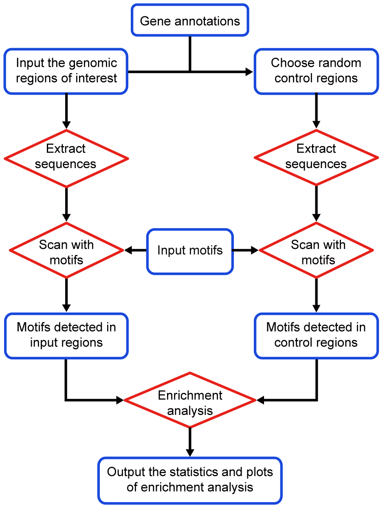

.. _home:

Welcome to MotifScan
====================

.. image:: https://github.com/shao-lab/MotifScan/workflows/Python%20package/badge.svg
   :alt: Github Actions
   :target: https://github.com/shao-lab/MotifScan/actions
.. image:: https://readthedocs.org/projects/motifscan/badge/?version=latest
   :alt: Documentation Status
   :target: https://motifscan.readthedocs.io/en/latest/?badge=latest
.. image:: https://img.shields.io/pypi/v/motifscan.svg
   :alt: PyPI
   :target: https://pypi.org/project/motifscan/
.. image:: https://img.shields.io/pypi/pyversions/motifscan.svg
   :alt: Python Version
   :target: https://pypi.org/project/motifscan/
.. image:: https://img.shields.io/badge/install%20with-bioconda-brightgreen.svg?style=flat-square
   :alt: Bioconda
   :target: http://bioconda.github.io/recipes/motifscan/README.html
.. image:: https://codecov.io/gh/shao-lab/MotifScan/branch/master/graph/badge.svg
   :alt: Codecov
   :target: https://codecov.io/gh/shao-lab/MotifScan
.. image:: https://img.shields.io/pypi/l/motifscan.svg
   :alt: License
   :target: https://github.com/shao-lab/MotifScan/blob/master/LICENSE

MotifScan
---------

**Scan input genomic regions with known DNA motifs**

Given a set of input genomic regions, MotifScan scans the sequences to
detect the occurrences of known motifs. It can also applies a statistical test
on each motif to check whether the motif is significantly over- or under-represented
(enriched or depleted) in the input genomic regions compared to another set of control
regions.

Workflow
--------

Citation
--------

`Sun, H., Wang, J., Gong, Z. et al. Quantitative integration of epigenomic variation and
transcription factor binding using MAmotif toolkit identifies an important role of IRF2
as transcription activator at gene promoters. Cell Discov 4, 38 (2018).`__

.. __: https://doi.org/10.1038/s41421-018-0045-y

Contents
--------

.. toctree::
   :maxdepth: 1

   Home<self>
   install
   quickstart
   userguide
   changelog
   faq
   help
   license

---------------

The MotifScan package is developed by ShaoLab_ at `CAS-MPG Partner Institute for Computational Biology, SIBS,
CAS`_.

.. seealso::
   GitHub repository of MotifScan: https://github.com/shao-lab/MotifScan

.. _ShaoLab: http://bioinfo.sibs.ac.cn/shaolab/
.. _CAS-MPG Partner Institute for Computational Biology, SIBS, CAS: https://www.picb.ac.cn/
