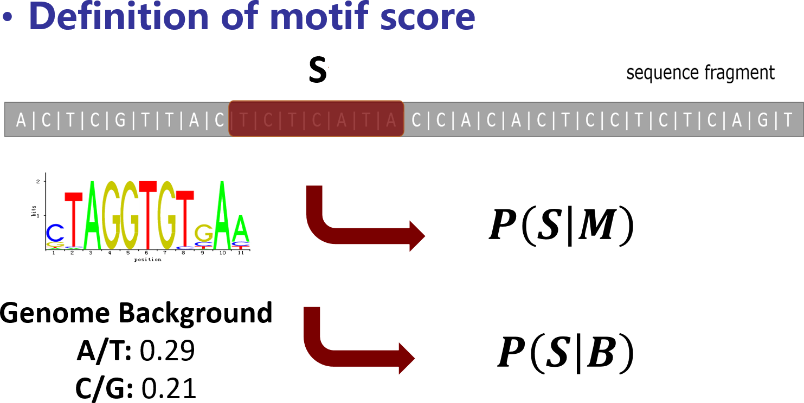

.. _userguide:

==========
User Guide
==========

.. contents::
   :local:

.. _`userguide config`:

Configuration
=============

The ``config`` command of MotifScan manages the data paths of required
genome assemblies and motif sets (PFMs/PWMs).

The configurations include:

    - The default install location for genome assemblies
    - The default install location for motif sets
    - The path of every installed genome assembly
    - The path of every installed motif set

Config file
-----------

All the configurations are stored within a user specific config file which is
located at ``$HOME/.motifscanrc``

Example::

    [motifscan]
    genome_dir = $HOME/.motifscan/genomes/
    motif_dir = $HOME/.motifscan/motifs/
    [genome]
    hg19 = $HOME/.motifscan/genomes/hg19
    [motif]
    vertebrates = $HOME/.motifscan/motifs/vertebrates

The ``genome_dir`` and ``motif_dir`` entries set the default location for newly installed
genome assemblies and motif sets, respectively.

Under the ``[genome]`` section, each row records the path of an installed genome assembly.

Under the ``[motif]`` section, each row records the path of an installed motif set,
motif set PFMs file and PWMs file(s) are stored under the directory.

Show configurations
-------------------

Display current configurations:

.. code-block:: shell

    $ motifscan config --show

Default installation location
-----------------------------

Newly installed genome assemblies are placed under ``$HOME/.motifscan/genomes/``,
if you want to change it:

.. code-block:: shell

    $ motifscan config --set-default-genome <path>

As for motif sets (PFMs/PWMs), the default path is under ``$HOME/.motifscan/motifs/``,
you can also change it with command:

.. code-block:: shell

    $ motifscan config --set-default-motif <path>

Data path modifiers
-------------------

Whenever you newly install a genome assembly/motif set, the path of the
genome/motif data directory is automatically saved in the configurations.
If you later move the genome/motif directory to another place, you may have to
modify the path manually.

Modify the path of an installed genome assembly:

.. code-block:: shell

    $ motifscan config --set-genome <genome_name> <path>

Or modify the path of an installed motif set:

.. code-block:: shell

    $ motifscan config --set-motif <motif_set> <path>

.. tip::

    Please use the command ``motifscan config -h`` to see all the options.

Genome Subcommands
==================

The `genome` command controls the genome assemblies used by MotifScan.
MotifScan requires a sequences FASTA file and a gene annotation file
(if available) for each genome assembly, users can either download them
from a remote database or install directly with local prepared files.

Display installed genomes
-------------------------

The ``--list`` option of the genome command tells MotifScan to display all the
installed genome assemblies:

.. code-block:: shell

    $ motifscan genome --list

Remote genome databases
-----------------------

MotifScan can access remote genome databases. `UCSC`_ is the only database MotifScan supports currently.

Display all available genome assemblies in the UCSC genome database:

.. code-block:: shell

    $ motifscan genome --list-remote

Search for genome assemblies by a keyword:

.. code-block:: shell

    $ motifscan genome --search <KEYWORD>

Install genomes from a remote database
--------------------------------------

To install a genome assembly directly from the UCSC genome database:

.. code-block:: shell

    $ motifscan genome --install -n <genome_name> -r <remote_name>

The ``-r/--remote`` option specifies which remote genome is to be installed, and you
can give it a custom name with the ``-n/--name`` option, this genome name is used
to refer to the installed genome from then on.

Install genomes with local files
--------------------------------

You can alternatively use local prepared genome data files to install a genome
assembly. Data files include a genome sequence FASTA file and a gene annotation
``refGene.txt`` file.

.. code-block:: shell

    $ motifscan genome --install -n <genome_name> -i <FASTA.fa> -a <refGene.txt>

Uninstall genomes
-----------------

If a genome assembly is no longer used, you can choose to uninstall it:

.. code-block:: shell

    $ motifscan genome --uninstall <genome_name>

Motif Subcommands
=================

MotifScan only detects the binding sites (occurrences) of known motifs. Before
scanning, the motif set should be installed with PFMs (Position Frequency Matrices)
and built to obtain PWMs (Position Weight Matrices) and motif score cutoffs.

The ``motif`` command handles the motif sets of MotifScan. Basic operations are
listed as follows.

Display installed motifs
------------------------

The ``--list`` option of the motif command tells MotifScan to display all the
installed motif PFMs sets:

.. code-block:: shell

    $ motifscan motif --list

Remote motif databases
----------------------

MotifScan can access remote motif databases. ``JASPAR CORE`` and ``JASPAR Collections``
are supported currently.

Display all available motif PFMs set in the JASPAR CORE motif database:

.. code-block:: shell

    $ motifscan motif --list-remote

Install motifs from a remote database
-------------------------------------

To install a motif PFMs set directly from the JASPAR CORE motif database:

.. code-block:: shell

    $ motifscan motif --install -n <motif_set> -r <remote_name>

The ``-r/--remote`` option specifies which remote motif PFMs set is to be installed,
and you can give it a custom name with the ``-n/--name`` option, this name is used
to refer to the installed motif PFMs set from then on.

Install motifs with local files
-------------------------------

You can alternatively use local prepared motif PFMs files to install a motif set.
The PFMs file should follow the JASPAR motif format.

.. code-block:: shell

    $ motifscan motif --install -n <motif_set> -i <pfms.jaspar>

Example::

    >MA0006.1       Ahr::Arnt
    A  [     3      0      0      0      0      0 ]
    C  [     8      0     23      0      0      0 ]
    G  [     2     23      0     23      0     24 ]
    T  [    11      1      1      1     24      0 ]

Build motif PFMs into PWMs
--------------------------

After the motif PFMs set are installed, it needs to be built under a specific
genome assembly to obtain PWMs and motif score cutoffs for motif occurrences.
Since different assemblies have different genome contents, it is necessary to
build the PFMs and get proper motif score cutoffs for every genome assembly you
want to scan later.

.. code-block:: shell

    $ motifscan motif --build -n <motif_set> -g <genome_name>

Motif score and cutoffs
-----------------------

Motif score
^^^^^^^^^^^

MotifScan uses ``motif score`` to measure the similarity between a sequence
``S`` and the motif matrix ``M`` under specific genome background ``B``.

.. math::

    Raw\ motif\ score = \log\frac{P(S|M)}{P(S|B)}

The ``raw motif score`` is calculated as the *log*-scaled ratio of the probability to
observe ``S`` given the motif matrix ``M`` and the probability to observe ``S``
given the genome nucleotides background ``B``.

.. math::

    Motif\ Score = \frac{Raw\ motif\ score\ of\ S}{Max(all\ possible\ raw\ motif\ scores)}

And ``motif score`` is defined as the normalized form of ``raw motif score``
(divided by the maximal possible raw motif score).

Motif score cutoffs
^^^^^^^^^^^^^^^^^^^

The background distribution of the motif score is modeled by randomly sampling 10^6 times
from whole genome background, and motif score cutoffs of different significance levels are
determined according to the sampling distribution of the motif score.

By default, the sampling goes for 1,000,000 times and motif score cutoffs for P-value
1e-2, 1e-3, 1e-4, 1e-5 and 1e-6 are obtained.

Users can also trigger the ``--n-repeat`` option to perform the whole sampling procedure
described above for multiple times and use the averaged cutoffs as final cutoffs.

Uninstall motifs
----------------

You can choose to uninstall no longer used motif set:

.. code-block:: shell

    $ motifscan motif --uninstall <motif_set>

Scan Command
============

This main command invokes to scan the sequences of user specified input
genomic regions and detect the occurrences for a set of known motifs.
After scanning the input regions, an optional motif enrichment analysis
is performed to check whether these motifs are over/under-represented
compared to control regions (can be random generated or user specified).

Basic Usage
-----------

The basic usage is to specify the genomic regions to be scanned, the genome name,
the motif set to scan for, and the output directory.

.. code-block:: shell

    $ motifscan scan -i <regions.bed> -g <genome_name> -m <motif_set> -o <output_dir>

Regions file format
-------------------

MotifScan supports multiple formats for the genomic regions file, you can use
``-f`` option to specify the format, see :ref:`region file formats` for more details.

Scanning Options
----------------

-p                     P value cutoff for motif scores. Default: 1e-4
--loc                  If specified, only scan promoter or distal regions.
--upstream             TSS upstream distance for promoters. Default: 4000
--downstream           TSS downstream distance for promoters. Default: 2000
-w, --window-size      Window size for scanning. In most cases, motifs occur
                       closely around the centers or summits of genomic peaks.
                       Scanning a fixed-size window is often sufficient to detect
                       motif sites and unbiased for the enrichment analysis.
                       If set to 0, the whole input regions are included for
                       scanning. Default: 1000
--strand               Enable strand-specific scanning, defaults to scan both strands.

Motif Enrichment Analysis
-------------------------

After scanning the input genomic regions, MotifScan will randomly generate some
control regions to perform a motif enrichment analysis. The random generated regions
are controlled to have similar genomic locations (promoter/distal, distance to
nearest TSS etc.) with the input regions. Users can optionally specify a set of custom
control regions for the motif enrichment analysis.

--no-enrich           Disable the enrichment analysis.
--n-random N          Generate N random control regions for each input region. Default: 5
--seed SEED           Random seed used to generate control regions.
-c FILE               Use custom control regions for the enrichment analysis.
--cf                  Format of the control file. Default: bed

Speed up  with multiple threads
-------------------------------

Even through the scanning functions are implemented in C extensions to improve the speed,
the scanning procedure still takes a while especially when the input genomic regions is large.
Try to specify ``-t`` options to use multiple threads to make it faster if your machine allows.

Optional output files
---------------------
--site              If set, report bed files with the positions for detected motif sites.
--plot              If set, plot the distributions of detected motif sites.

.. _`region file formats`:

Genomic Regions Format
======================

.. note::

    The ``score`` attribute is *required* if you specify the ``--plot`` option.

BED
---

Standard `BED`_ format is supported, columns ``chrom``, ``start``, ``end`` and
``score`` are used.

BED3-summit
-----------

A customized BED format named as ``BED3-summit`` is also supported, the first 3
columns is the same as ``BED`` format, and the 4th columns should be the absolute
``summit`` position.

.. note:: This is not a standard format but a variant of ``BED3`` for convenience.

MACS
----

`MACS`_ (version 1.x) xls format is supported, the ``chrom``, ``start``, ``end``,
``summit`` and ``-10*log10(pvalue)`` columns are used.

MACS2
-----

`MACS2`_ xls format is supported, the ``chrom``, ``start``, ``end``, ``summit``
and ``-log10(pvalue)`` columns are used.

.. warning:: This is not compatible with the broad mode of MACS2.

narrowPeak
----------

ENCODE `narrowPeak`_ format is supported, the columns ``chrom``, ``start``, ``end``
and ``score`` are used. If the 10th column is available, MotifScan uses it as the
``summit`` coordinate.

broadPeak
---------

ENCODE `broadPeak`_ format is supported, the columns ``chrom``, ``start``, ``end``
and ``score`` are used.

.. note::

    Specify the option ``-w/--window-size`` to ``0`` if you want to scan the whole
    broad regions, this can be very time consuming.

manorm
------

`MAnorm`_ output xls files are also supported, the columns ``chrom``, ``start``, ``end``,
``summit`` and ``M_value`` are used.

Output Files
============

- *motif_sites_number.xls*

This file summarizes the numbers of detected motif sites (occurrences) for the
input genomic regions. The first 3 columns specify the genomic coordinates
(1-based) and additional columns report the numbers of detected motif sites within
each input region.

- *motif_sites_score.xls*

This file reports the maximal motif scores of motifs for each input genomic region.
If a motif have no sites detected within a specific genomic region, the corresponding
value will be reported as `NA`. Coordinates are also 1-based.

- motif_enrichment.xls

This file is written when the motif enrichment analysis is performed.

    * Motif: Motif name.
    * Num_input_regions: The number of input genomic regions which have at least 1 motif site.
    * Num_control_regions: The number of control genomic regions which have at least 1 motif site.
    * Fold_change: Ratio between the fraction of input regions with motif site(s) and the fraction
      of control regions with motif site(s).
    * Enriched_P_value: P value of single-sided fisher exact test, alternative='greater'.
    * Depleted_P_value: P value of single-sided fisher exact test, alternative='less).
    * Corrected_P_value: Bonferroni corrected P value (the smaller one between enriched and depleted).

- *motif_sites/<motif_name>_sites.bed*

These files reports the detailed positions of all detected motif sites.

.. note::
    These files are only generated when the ``--site`` option is enabled.

- *plot/<motif_name>_sites_distributions.pdf*

These figures shows the genomic position distributions of detected motif sites
relative to the summits or centers of the input genomic regions.

.. note::
    These files are only generated when the ``--plot`` option is enabled.
    If ``-w`` is 0, input genomic regions are required to have the same length.

- *plot/<motif_name>_sites_enrichment.pdf*

These figures shows the enrichment (fold change) of detected motif sites number
between input and control genomic regions. Input genomic regions are ranked by the
``score`` attribute.

It is helpful when you want to check the correlation between a motif and certain
attribute of the input genomic regions. For example, if the score values represent
the ChIP-seq intensities, you can inspect if a motif is more enriched (appears more
frequently) at genomic regions with higher ChIP-seq signals.

.. note::
    These files are only generated when the ``--plot`` option is enabled and motif
    enrichment analysis is performed. Input genomic regions are required to have the
    ``score`` information, otherwise MotifScan will not report these figures.

.. _UCSC: https://genome.ucsc.edu/
.. _JASPAR motif format: http://jaspar.genereg.net/faq/#data-formats
.. _BED: https://genome.ucsc.edu/FAQ/FAQformat.html#format1
.. _MACS: https://github.com/taoliu/MACS
.. _MACS2: https://github.com/taoliu/MACS
.. _narrowPeak: https://genome.ucsc.edu/FAQ/FAQformat.html#format12
.. _broadPeak: https://genome.ucsc.edu/FAQ/FAQformat.html#format13
.. _MAnorm: https://github.com/shao-lab/MAnorm
